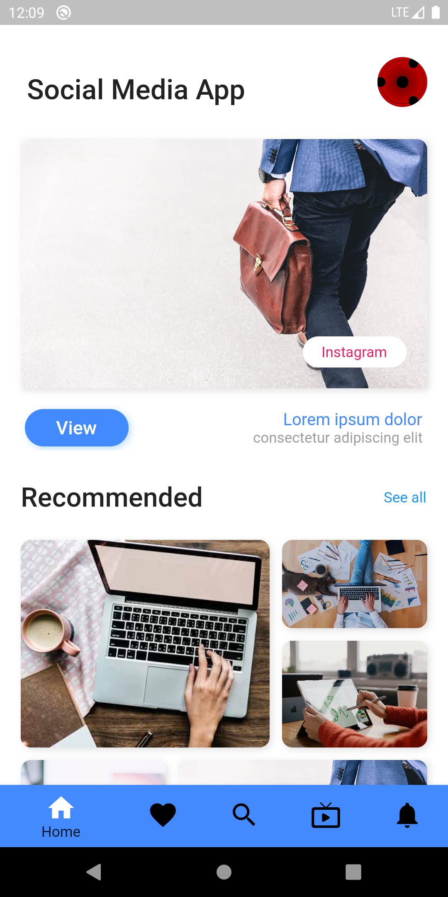
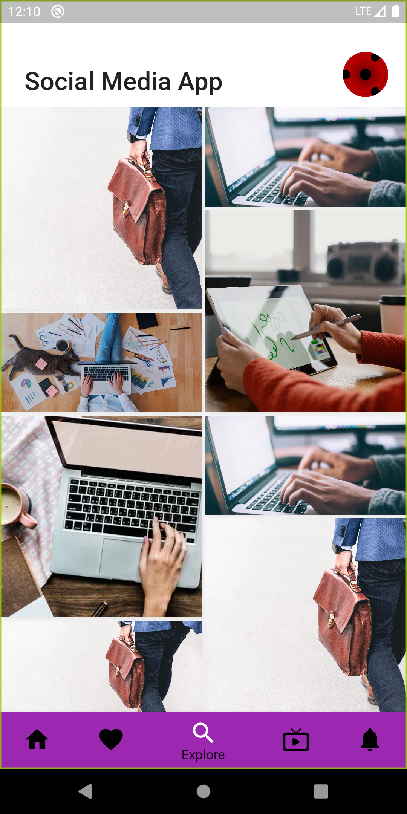
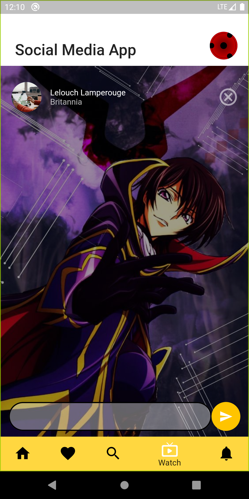
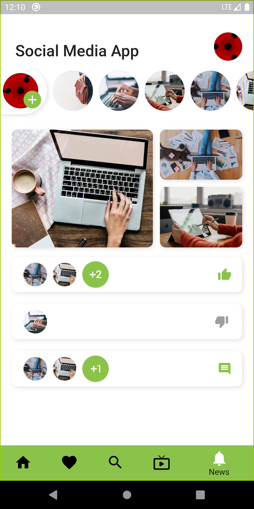

# Social Media App
Complete User Interface of A Social-media App
 
### Languages & tools :
[][android]
[][dart]
[][flutter]
  

|Social-Media App Home| Social-Media App Explore | Social-Media App Watch | Social-Media App Notifications|
|------|-------|-------|------|
|||||

### Directory Structure :
    |-- social_media_app
    |    |-- android
    |    |-- Assets
    |    |   |-- Fonts
    |    |   |   |-- Roboto-Regular.ttf
    |    |   |
    |    |   |--Images  
    |    |       |-- image1.jpg
    |    |       |-- image2.jpg
    |    |       |-- image3.jpg
    |    |       |-- image4.jpg
    |    |       |-- image5.jpg
    |    |       |-- imageLive.jpg
    |    |       |-- instaIcon.svg
    |    |
    |    |-- ios
    |    |
    |    |-- lib
    |    |   |-- Data
    |    |   |   |-- recentList.dart
    |    |   |
    |    |   |-- screens
    |    |   |   |-- controller.dart
    |    |   |   |-- explore.dart
    |    |   |   |-- export.dart
    |    |   |   |-- home.dart
    |    |   |   |-- liked.dart
    |    |   |   |-- news.dart
    |    |   |   |-- watch.dart
    |    |   |   
    |    |   |-- widget
    |    |   |   |-- CustomeAppBar.dart
    |    |   |
    |    |   |-- main.dart
    |    |
    |    |-- pubspec.lock
    |    |-- pubspec.yaml
    |    |-- README.md
    |
    |-- Img
    |    |-- androidstudio.png
    |    |-- dart.png
    |    |-- flutter.png
    |    |-- SocialMediaApp1.png
    |    |-- SocialMediaApp2.png
    |    |-- SocialMediaApp3.png
    |    |-- SocialMediaApp4.png
    |    |-- SocialMediaApp5.png

### Connect with me :  

  
 

[website]: https://abhilashtuofficial.github.io/
[dart]: https://github.com/AbhilashTUofficial/CloneApps
[flutter]: https://github.com/AbhilashTUofficial/CloneApps
[android]: https://github.com/AbhilashTUofficial/CloneApps

